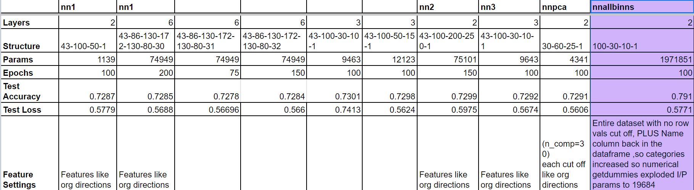
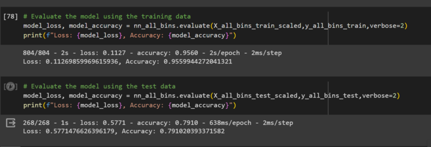

# deep-learning-challenge

### Initial observations from the 2 challenge files

### The file, the AlphabetSoupCharity_1NN_MJoshi.ipynb, has the following settings as per the directions in the challenge assignment, prior to the data getting trained on the neural network:

*  Drop the non-beneficial ID columns, 'EIN' and 'NAME'.
*  Choose a cutoff value and create a list of application types to be replaced
*   For columns that have more than 10 unique values, determine the number of data points for each unique value.
*   Use the number of data points for each unique value to pick a cutoff point to bin "rare" categorical variables together in a new value, Other, and then check if the binning was successful.
*   Use pd.get_dummies() to encode categorical variables.
*   Split the preprocessed data into a features array, X, and a target array, y. Use these arrays and the train_test_split function to split the data into training and testing datasets.
*   Scale the training and testing features datasets by creating a StandardScaler instance, fitting it to the training data, then using the transform function.

### It was noted that with the above settings/modifications to the dataframe, a test data accuracy of about 73% was achieved, which is less than the desired one. Therefore, creating another file as directed in the instructions to conduct further test runs to obtain accuracy greater than 75%.

## Below is from the second file named AlphabetSoupCharity_Optimization_MJoshi.ipynb

#### Below is a summary table of all the runs done on the neural network with different settings for the dataframe and the neural network.

### The file initially has multiple runs based on the following settings as per the directions in the challenge assignment:

*  Drop the non-beneficial ID columns, 'EIN' and 'NAME'.
*  Choose a cutoff value and create a list of application types to be replaced
*   For columns that have more than 10 unique values, determine the number of data points for each unique value.
*   Use the number of data points for each unique value to pick a cutoff point to bin "rare" categorical variables together in a new value, Other, and then check if the binning was successful.
*   Use pd.get_dummies() to encode categorical variables.
*   Split the preprocessed data into a features array, X, and a target array, y. Use these arrays and the train_test_split function to split the data into training and testing datasets.
*   Scale the training and testing features datasets by creating a StandardScaler instance, fitting it to the training data, then using the transform function.

### Please note that after the first 9 runs, it was determined that there were not enough input parameters in the network for obtaining test data accuracy score over 75%.

Two parameters were changed to the dataframe being trained on thus far:
*   The NAME column needed to be added back into the dataframe  
*   Creating more bins for rare occurrences in the application_name and classification columns.

### Taking this approach provided the desired test data accuracy at 79%

Model was saved at 
/usr/local/lib/python3.10/dist-packages/keras/src/engine/training.py

# Report

## Overview of the Analysis

The goal of this analysis was to create a binary classifier using a neural network to predict whether organizations receiving funding from Alphabet Soup would be successful. The dataset contained information about various organizations, including application type, affiliation, classification, use case, organization type, status, income classification, special considerations, funding amount requested, and whether the funding was successful.

The initial analysis involved data preprocessing to enhance the model's performance. Several iterations were conducted, adjusting parameters, dropping columns, encoding categorical variables, and optimizing the binning of rare occurrences. The ultimate objective was to achieve a test data accuracy score greater than 75%.

## Results

### Data Preprocessing

#### Target and Features
- **Target Variable(s):** `IS_SUCCESSFUL` (binary indicating whether the funding was successful).
- **Features:** Various columns including `APPLICATION_TYPE`, `AFFILIATION`, `CLASSIFICATION`, `USE_CASE`, `ORGANIZATION`, `STATUS`, `INCOME_AMT`, `SPECIAL_CONSIDERATIONS`, and `ASK_AMT`.

#### Removed Variables
- `EIN` and `NAME` columns were initially dropped as non-beneficial ID columns. However, in subsequent runs, the `NAME` column was added back to improve model performance.

### Compiling, Training, and Evaluating the Model

#### Neural Network Architecture
- **Neurons:** The number of neurons, layers, and activation functions were adjusted in multiple runs. Initially, not enough parameters were present, so modifications were made to address this. 
- **Activation Functions:** A combination of Relu and Sigmoid functions were used to optimize the final neural network that was used for successfully training the network to predict the target variable with 79% accuracy.

#### Model Performance
- **Target Performance:** The desired test data accuracy of greater than 75% was achieved. 
- **Steps to Improve Performance:** Changes to the dataframe included adding the `NAME` column back and creating more bins for rare occurrences in `APPLICATION_TYPE` and `CLASSIFICATION`. These adjustments were crucial in reaching the target accuracy.

## Summary

The deep learning model successfully achieved the desired test data accuracy of 79% after several iterations of data preprocessing and adjustments to the neural network architecture. The decision to include the `NAME` column and refine the binning process for certain categorical variables significantly contributed to this improvement.

### Recommendation for a Different Model

Considering the success of the neural network, it appears to be a suitable choice for this classification problem. However, other models such as Random Forests or Gradient Boosting could also be explored for comparison. Ensemble methods often handle complex relationships well and might provide an alternative or complementary solution. Further experimentation with different algorithms could offer additional insights and potentially enhance model performance.

